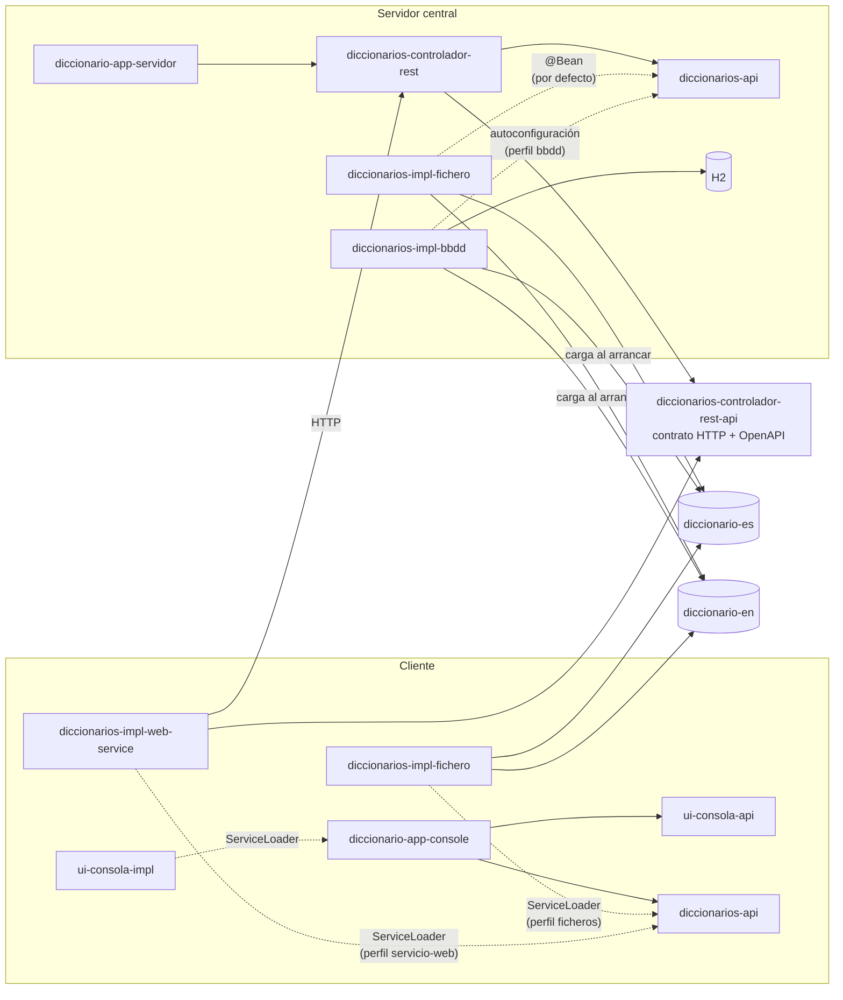

# Diccionario

Busca una palabra en el diccionario de un idioma y muestra sus significados con ejemplos.
Sirve para practicar el sistema de módulos de Java (JPMS), el `ServiceLoader`, las pruebas de
contrato, los streams, la evolución de un API sin romperlo, y un servicio REST con Spring Boot.

```
$ buscarPalabra ES melón
La palabra melón existe en el idioma ES y tiene los siguientes significados:
- Fruto grande, redondo y de pulpa jugosa y dulce.
    Ej: Me gusta comer melón!
- Persona con pocas luces.
    Ej: Eres un melón
    Ej: No seas melón
```

Las piezas se combinan sin tocar código: la misma app de consola puede leer los diccionarios de
ficheros que lleva consigo o pedírselos a un servidor central, y el servidor puede tenerlos en
memoria o en una base de datos.

## Requisitos

- JDK 17 o superior (se compila con `release 17`; probado con JDK 25).
- Maven 3.9+.

## Arquitectura



### Componentes

Cada componente versiona por su cuenta: el número cambia solo cuando cambia él.

| Componente | Versión | Qué es | Tipo |
|---|---|---|---|
| `diccionarios-api` | 1.2.0 | Las interfaces (`SuministradorDeDiccionarios`, `Diccionario`, `Significado`, `ResultadoDeBusquedaDePalabra`) y las pruebas de contrato (`test-jar`) | módulo JPMS `api.diccionarios` |
| `diccionarios-impl-fichero` | 1.2.0 | Implementación que lee los ficheros `.txt`. Exporta también el formato de fichero y el catálogo del classpath | módulo JPMS `impl.diccionarios.en.ficheros` |
| `diccionarios-impl-web-service` | 1.1.0 | Implementación que pregunta al servidor por HTTP (`java.net.http` + Gson) | módulo JPMS `impl.diccionarios.en.servicio.web` |
| `diccionarios-impl-bbdd` | 1.0.0 | Implementación en BBDD con Spring Data JPA. Se enchufa sola por autoconfiguración | librería Spring |
| `diccionario-es`, `diccionario-en` | 1.0.0 | Solo datos: el fichero del idioma y su índice | jar de recursos |
| `ui-consola-api` | 1.0.0 | Todo lo que la app le dice o pide al usuario | módulo JPMS `api.ui.consola` |
| `ui-consola-impl` | 1.0.0 | La de línea de comandos: lee idioma y palabra de los argumentos | módulo JPMS `impl.ui.consola.argumentos` |
| `diccionario-app-console` | 1.2.0 | El `main`: solo monta las piezas. La lógica está en `ProcesadorDePeticiones` | módulo JPMS `app` |
| `diccionarios-controlador-rest-api` | 1.0.0 | El contrato HTTP: rutas, DTO, códigos de error, documentación OpenAPI | librería (anotaciones Spring) |
| `diccionarios-controlador-rest` | 1.1.0 | El `@RestController` que traduce HTTP ↔ API Java, y su `@RestControllerAdvice` | librería Spring |
| `diccionario-app-servidor` | 1.1.0 | La aplicación Spring Boot del servidor central | aplicación Spring Boot |

Los módulos JPMS heredan de `diccionario-padre` (la raíz). Los de Spring son proyectos
independientes (su propio `pom` con el BOM de Spring Boot), aunque el agregador de la raíz los
construya todos juntos.

## Comandos

Todo desde esta carpeta (la raíz del proyecto).

### Compilar, probar e instalar

```bash
mvn install                 # todo: compila, pasa las pruebas y deja los jars en target/ y en ~/.m2
mvn install -DskipTests     # lo mismo sin pruebas
mvn verify                  # pruebas + informe de cobertura (target/site/jacoco/index.html de cada módulo)
mvn install -Pbbdd          # el servidor con la implementación en BBDD (ver más abajo)
```

> `mvn clean` borra el `target/` de un proceso que esté corriendo (el servidor con
> `spring-boot:run`, por ejemplo): la JVM sigue viva pero no puede cargar clases nuevas y deja de
> responder sin decir nada. Reinícialo después de cada `clean`.

### Combinación 1: consola con ficheros (por defecto)

La app lleva los jars de `diccionario-es` y `diccionario-en`, y la implementación de ficheros.

```bash
mvn install -DskipTests
mvn exec:exec -pl diccionario-app-console -Dargumentos="ES melón"
```

Con `java` directamente (después de `mvn package`):

```bash
java --module-path diccionarios-api/target/diccionarios-api-1.2.0.jar:ui-consola-api/target/ui-consola-api-1.0.0.jar:ui-consola-impl/target/ui-consola-impl-1.0.0.jar:diccionarios-impl-fichero/target/diccionarios-impl-fichero-1.2.0.jar:diccionario-es/target/diccionario-es-1.0.0.jar:diccionario-en/target/diccionario-en-1.0.0.jar:diccionario-app-console/target/diccionario-app-console-1.2.0.jar \
     --add-modules ALL-MODULE-PATH \
     --module app/com.curso.diccionario.app.consola.BuscarPalabra ES melón
```

- `--add-modules ALL-MODULE-PATH`: las implementaciones y los diccionarios no los requiere ningún
  módulo (se encuentran por el `ServiceLoader` y por el class loader), y un módulo que nadie
  requiere no se carga.
- Quitar un idioma es quitar su jar del module path. No hay nada más que configurar.
- Con `DICCIONARIOS_CARPETA=/ruta/` se leen los `<idioma>.txt` de una carpeta del disco en vez de
  los jars.
- En Windows el separador del *module path* es `;` en lugar de `:`.

### Combinación 2: consola contra el servidor central

La app no lleva ningún diccionario: se los pide al servidor (arráncalo antes, ver la combinación 3).

```bash
mvn exec:exec -pl diccionario-app-console -Pservicio-web -Dargumentos="ES melón"
```

```bash
java --module-path diccionarios-api/target/diccionarios-api-1.2.0.jar:ui-consola-api/target/ui-consola-api-1.0.0.jar:ui-consola-impl/target/ui-consola-impl-1.0.0.jar:diccionarios-impl-web-service/target/diccionarios-impl-web-service-1.1.0.jar:diccionarios-controlador-rest-api/target/diccionarios-controlador-rest-api-1.0.0.jar:$HOME/.m2/repository/com/google/code/gson/gson/2.14.0/gson-2.14.0.jar:diccionario-app-console/target/diccionario-app-console-1.2.0.jar \
     --add-modules ALL-MODULE-PATH \
     --module app/com.curso.diccionario.app.consola.BuscarPalabra ES melón
```

- El servidor, en `DICCIONARIOS_SERVIDOR` (por defecto `http://localhost:8080`).
- Del API REST solo hacen falta las rutas y los DTO: Spring y las anotaciones de swagger son
  `optional` en su pom y no tienen que estar en el module path.

Los perfiles `ficheros` y `servicio-web` son **excluyentes**: con dos implementaciones en el
module path, el `ServiceLoader` se queda con la primera que encuentra y no sabes cuál.

### Combinación 3: el servidor central

```bash
cd diccionario-app-servidor
mvn spring-boot:run              # diccionarios en memoria, leídos de los jars de idioma
mvn spring-boot:run -Pbbdd       # diccionarios en BBDD H2 (en ./datos/)
```

O con el jar: `java -jar diccionario-app-servidor/target/diccionario-app-servidor-1.1.0.jar`
(lleva BBDD si se empaquetó con `-Pbbdd`).

- API: `http://localhost:8080/api/v1/diccionarios`
- Swagger UI: `http://localhost:8080/swagger-ui.html`
- Especificación OpenAPI en marcha: `http://localhost:8080/v3/api-docs`

| Petición | Respuesta |
|---|---|
| `GET /api/v1/diccionarios` | 200 con los idiomas: `["EN","ES"]` |
| `GET /api/v1/diccionarios/{idioma}` | 200 `{"idioma":"ES"}`, o 404 `IDIOMA_NO_DISPONIBLE` |
| `GET /api/v1/diccionarios/{idioma}/palabras/{palabra}` | 200 con los significados, o 404 `IDIOMA_NO_DISPONIBLE` / `PALABRA_NO_ENCONTRADA` |
| cualquiera | 500 `ERROR_INTERNO` si algo falla, sin detalles internos |

Los dos 404 se distinguen por el campo `codigo` del cuerpo, no por el status.

#### Con BBDD (perfil `bbdd`)

Basta con añadir el módulo: trae su autoconfiguración, y la configuración del servidor aparta la
implementación de ficheros cuando lo ve en el classpath. Al arrancar, un `ApplicationRunner`
deja la BBDD igual que los ficheros de los jars de idioma:

- Guarda la huella (SHA-256) de cada fichero cargado. Si no ha cambiado, no recarga nada: el
  segundo arranque no toca la BBDD.
- Si cambia, borra las palabras de ese idioma y carga las nuevas **en una transacción**: nadie ve
  el idioma a medio cargar, y si algo falla se queda el de antes.
- Si un idioma ya no tiene jar, lo borra.

H2 en **fichero** (`./datos/`), no en memoria: en memoria la BBDD se vacía en cada arranque y la
huella no evitaría ninguna recarga. Para otra BBDD, otro driver y otra `spring.datasource.url`.

### La especificación OpenAPI

La genera `mvn package` del proyecto `diccionarios-controlador-rest-api` a partir de las
anotaciones del interfaz (nada se escribe dos veces):

- `diccionarios-controlador-rest-api/target/openapi.yaml`
- y dentro de su jar, en `openapi/diccionarios.yaml`.

## Los diccionarios

Un jar por idioma (`diccionario-es`, `diccionario-en`), con dos ficheros en `META-INF/diccionarios/`:

- `<idioma>.txt`, en UTF-8, una línea por palabra:

  ```
  palabra=significado1(ejemplo1)(ejemplo2)|significado2(ejemplo1)|significado3
  ```

  Los caracteres `=`, `|`, `(` y `)` están reservados: el formato no los escapa.

- `idiomas`: el código del idioma (`ES`). Dentro de un jar no se puede listar una carpeta, pero
  `ClassLoader.getResources` (en plural) devuelve **todos** los `idiomas` del classpath: los idiomas
  disponibles son, por construcción, los jars que hay. En `META-INF` porque no es un paquete: en el
  module path no hace falta `opens`, y varios jars pueden tener la misma carpeta sin que sea un
  paquete partido entre módulos.

Cada uno tiene unas pocas palabras reales escritas a mano (melón, banco, gato... / melon, bank, cat...)
y **5000 inventadas**, las mismas en los dos idiomas, con acepciones y ejemplos escritos en cada
uno. No hay de dónde sacar 5000 palabras reales con definición y traducción con licencia para
copiarlas. Las genera, siempre iguales (semilla fija), `herramientas/GeneradorDeDiccionarios.java`:

```bash
java herramientas/GeneradorDeDiccionarios.java
```

## Cómo evoluciona el API

El API se ha cambiado dos veces sin romper a nadie: método nuevo con `default` que delega en el
viejo, y el viejo `@Deprecated(forRemoval = true)`. Las implementaciones antiguas siguen
compilando, así que cada cambio es un **minor**.

| Versión | Antes (deprecado) | Ahora | Por qué |
|---|---|---|---|
| 1.1.0 | `existe`, `tienesDiccionarioDe`, `getDiccionario`, `getSignificados` | `existeLaPalabra`, `tienesDiccionarioDeIdioma`, `getDiccionarioBuena` (con `throws Exception`), `buscarPalabra` (con un `ResultadoDeBusquedaDePalabra` sellado) | Los errores no tenían forma de llegar a quien pregunta |
| 1.2.0 | `getIdiomas` | `getIdiomasDisponibles() throws Exception` | Un fallo se disfrazaba de "no hay idiomas" |

Los deprecados se quedan a propósito: quitarlos rompería a quien los use y sería un **major** (2.0.0).

## Pruebas

| Dónde | Qué prueban |
|---|---|
| `diccionarios-api` | El **contrato**: lo que cualquier implementación tiene que cumplir. Se reparte como `test-jar`. Lo cumple una implementación de referencia en memoria |
| `diccionarios-impl-fichero` | El contrato, con ficheros generados; el formato contra un fichero escrito a mano; la lectura del classpath y del índice |
| `diccionarios-impl-bbdd` | El contrato, contra H2 en memoria; el cargador: primera carga, huella sin cambios, versión nueva, idioma que desaparece |
| `diccionarios-impl-web-service` | Contra un servidor falso (`com.sun.net.httpserver`, del JDK): cada 404, 500, URL mal codificada, servidor caído |
| `diccionario-app-servidor` | Que arranca y sirve los jars de idioma; y **el cliente web cumple el contrato contra este servidor de verdad** |
| `diccionarios-controlador-rest` | Las URLs, status y JSON del controlador con `@WebMvcTest` |
| `ui-consola-impl`, `diccionario-app-console` | Los mensajes de la consola; la lógica del procesador con una interfaz de usuario falsa, sin capturar la consola |

## Limitaciones conocidas

- **Diccionarios de mentira.** Las 5000 palabras de cada idioma son inventadas (ver arriba).
- **El servidor con BBDD acepta peticiones mientras carga.** El `ApplicationRunner` se ejecuta
  con Tomcat ya escuchando: durante la primera carga (un par de segundos) responde como si no
  hubiera idiomas. En Kubernetes lo cubre la *readiness probe* de Spring Boot, que no da el
  servicio por listo hasta que terminan los runners.
- **Solo module path** para la consola: en el classpath el `ServiceLoader` no usa `provides` sino
  `META-INF/services`, que no existe, y además exige un constructor público sin argumentos.
- **La cache de la implementación de ficheros no libera nada.** Es un `ConcurrentHashMap`: segura
  entre hilos, pero un idioma cargado se queda en memoria. Con pocos idiomas no compensa una cache
  con expulsión.
- **Java 17**: no hay `switch` con patrones sobre la interfaz sellada (Java 21), así que el
  compilador no avisa si aparece un caso nuevo de `ResultadoDeBusquedaDePalabra`.
