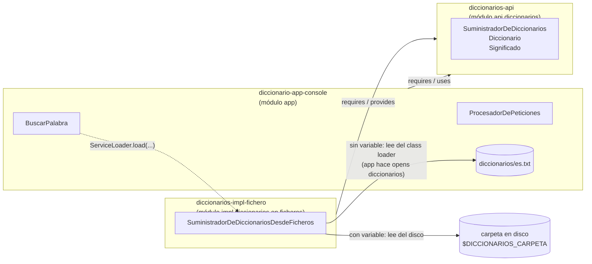
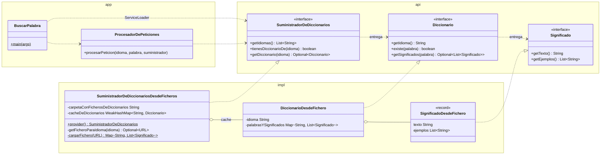

# Diccionario

Aplicación de consola que busca una palabra en el diccionario de un idioma y muestra sus
significados con ejemplos. Sirve para practicar el sistema de módulos de Java (JPMS), el
`ServiceLoader`, las pruebas de contrato y los streams.

```
$ buscarPalabra ES melón
La palabra melón existe en el idioma ES y tiene los siguientes significados:
- Fruto grande, redondo y de pulpa jugosa y dulce.
- Persona con pocas luces.
    Ej: Eres un melón
    Ej: No seas melón
```

## Requisitos

- JDK 17 o superior (se compila con `release 17`; probado con JDK 25).
- Maven 3.9+.

## Comandos

Todos desde esta carpeta (la raíz del proyecto).

### Compilar, probar e instalar

```bash
mvn install                 # compila, pasa las pruebas y deja los jars en target/ y en ~/.m2
mvn install -DskipTests     # lo mismo sin pruebas
mvn test                    # solo las pruebas
mvn verify                  # pruebas + informe de cobertura (target/site/jacoco/index.html)
```

> Si hay un `exec:exec` en marcha y haces `mvn clean`, borras el jar que está usando.
> Reinicia la ejecución después de cada `clean`.

### Ejecutar con el plugin de Maven

El `exec-maven-plugin` lanza `java` con el *module path*. Los argumentos van en la propiedad
`argumentos`:

```bash
mvn install -DskipTests
mvn exec:exec -pl diccionario-app-console -Dargumentos="ES melón"
```

`-pl` hace falta porque `exec:exec` necesita el jar del API y de la implementación ya
instalados en `~/.m2`. También se puede lanzar todo de una vez desde la raíz (el API y la
implementación tienen el plugin desactivado):

```bash
mvn package exec:exec -Dargumentos="ES gato"
```

### Ejecutar con `java` desde la línea de comandos

Después de `mvn package`, con los tres jars en el *module path*:

```bash
java --module-path diccionarios-api/target/diccionarios-api-1.0.0-SNAPSHOT.jar:diccionarios-impl-fichero/target/diccionarios-impl-fichero-1.0.0-SNAPSHOT.jar:diccionario-app-console/target/diccionario-app-console-1.0.0-SNAPSHOT.jar \
     --add-modules ALL-MODULE-PATH \
     --module app/com.curso.diccionario.app.consola.BuscarPalabra ES melón
```

- `--add-modules ALL-MODULE-PATH`: la implementación no la requiere ningún módulo (la app solo
  la conoce por el `ServiceLoader`), y un módulo que nadie requiere no se carga.
- En Windows el separador del *module path* es `;` en lugar de `:`.

### Usar diccionarios de una carpeta del disco

Por defecto los diccionarios se leen de `diccionarios/` dentro del classpath / module path
(ahora mismo, del jar de la app). Con la variable de entorno `DICCIONARIOS_CARPETA` se leen de
una carpeta del disco:

```bash
DICCIONARIOS_CARPETA=/ruta/a/mis/diccionarios java --module-path ... --module app/... ES hola
```

## Formato de los ficheros de diccionario

Un fichero por idioma, con el código del idioma en minúsculas: `ES` → `es.txt`. Codificación
UTF-8. Una línea por palabra:

```
palabra=significado1(ejemplo1)(ejemplo2)|significado2(ejemplo1)|significado3
```

Los caracteres `=`, `|`, `(` y `)` están reservados: el formato no los escapa. Una línea mal
escrita (por ejemplo, sin `=`) hace que **todo** ese diccionario se descarte: el error se
muestra por consola y la app responde que no tiene diccionario para ese idioma.

## Arquitectura

### Componentes

Tres módulos Maven, que son también tres módulos Java. La app depende solo del API; la
implementación se descubre en tiempo de ejecución.



| Módulo Maven | Módulo Java | Qué contiene | Dependencias |
|---|---|---|---|
| `diccionarios-api` | `api.diccionarios` | Las interfaces y las pruebas de contrato (`test-jar`) | — |
| `diccionarios-impl-fichero` | `impl.diccionarios.en.ficheros` | Implementación que lee ficheros `.txt`. No exporta nada: solo `provides` | API (compile) y pruebas de contrato del API (test) |
| `diccionario-app-console` | `app` | El `main`, la presentación por consola y `diccionarios/es.txt` | API (compile) e implementación (**runtime**) |

La implementación está en *scope* `runtime` a propósito: si alguien importa una de sus clases
desde la app, no compila.

### Clases



### Cómo se resuelve una búsqueda

```mermaid
sequenceDiagram
    actor U as Usuario
    participant BP as BuscarPalabra
    participant SL as ServiceLoader
    participant S as SuministradorDesdeFicheros
    participant D as DiccionarioDesdeFichero

    U->>BP: ES melón
    BP->>SL: load(SuministradorDeDiccionarios)
    SL->>S: provider()
    Note over S: lee DICCIONARIOS_CARPETA;<br/>si no está, usa "diccionarios/" del classpath
    BP->>S: getDiccionario("ES")
    alt ya en la cache
        S-->>BP: diccionario de la cache
    else primera vez
        S->>S: getFicheroParaIdioma → es.txt (disco o jar)
        S->>S: cargarFichero (streams)
        S->>D: new DiccionarioDesdeFichero(...)
        S-->>BP: Optional(diccionario)
    end
    BP->>D: getSignificados("melón")
    D-->>BP: Optional(lista de significados)
    BP-->>U: significados y ejemplos
```

### De dónde saca los diccionarios la implementación

- **Carpeta en disco** (`DICCIONARIOS_CARPETA` definida, o el constructor con una ruta que
  existe, que es lo que usan las pruebas): busca `<carpeta>/<idioma>.txt` y `getIdiomas()`
  lista los `*.txt` de la carpeta.
- **Classpath / module path** (sin variable): pide `diccionarios/<idioma>.txt` al class loader,
  así que el jar que los lleve puede ser cualquiera. En el module path ese jar tiene que hacer
  `opens diccionarios`; si no, el recurso está encapsulado y no se encuentra.
  `getIdiomas()` devuelve una lista fija (`ES`), filtrada por los que de verdad están: dentro
  de un jar no se puede listar una carpeta sin abrirlo como sistema de ficheros.

## Pruebas

- **Pruebas de contrato** (`diccionarios-api`, en `src/test/.../contrato`): lo que cualquier
  implementación tiene que cumplir. Se distribuyen como `test-jar` y cada implementación las
  hereda aportando solo cómo crear un suministrador con unos datos dados.
- **Implementación de referencia en memoria** (`.../referencia`): demuestra que el contrato es
  satisfacible. No se incluye en el `test-jar`.
- **Implementación en ficheros**: ejecuta el contrato contra ficheros generados en una carpeta
  temporal, comprueba que el generador escribe el mismo formato que un fichero escrito a mano, y
  prueba la lectura desde el classpath.

## Limitaciones conocidas

- **Solo module path.** En el classpath el `ServiceLoader` no usa `provides` sino
  `META-INF/services`, que no existe, y además exige un constructor público sin argumentos (el
  método estático `provider()` solo lo entiende en el module path).
- **Idiomas del classpath a capón**: hay que añadirlos a `IDIOMAS_EN_CLASSPATH`.
- **Errores por `System.out`**: los fallos al leer un diccionario se muestran por consola y se
  tratan como “no hay diccionario”.
- **La cache no libera nada.** Es un `WeakHashMap` cuya clave es el idioma, pero el valor
  (`DiccionarioDesdeFichero`) guarda ese mismo `String` en su campo `idioma`: el valor mantiene
  viva su propia clave y la entrada nunca se recoge. Tampoco es segura entre hilos.
